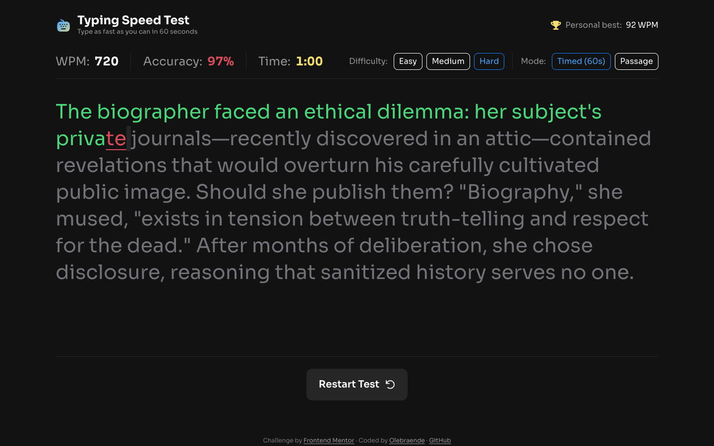

# Typing Speed Test

A fast, accessible typing test that measures **words per minute** and **accuracy** in real time.

**[Live demo](https://olebraende.github.io/typing-speed-test/)**



## Features

- **Two modes** – a 60 second countdown, or an untimed "Passage" mode where the clock counts up.
- **Three difficulty levels** with 60 passages in total. A shuffle bag serves every passage once before any repeats, and remembers its progress across sessions.
- **Live stats** – WPM, accuracy and time update while you type.
- **Honest accuracy** – corrected mistakes still count against you.
- **Personal best** persisted in `localStorage`, with distinct "Baseline Established!", "High Score Smashed!" and "Test Complete!" results, including a physics-based confetti celebration.
- **Typographic leniency** – a hyphen is accepted for an em dash, and a straight quote for a curly one.
- **Responsive** – pill controls on desktop turn into dropdowns on small screens.
- **Accessible** – native radio inputs, visible focus states, a live-region result message, and `prefers-reduced-motion` support.
- Press `Esc` at any time to restart with a new passage.

## Getting started

The app uses ES modules and `fetch`, so it needs to be served over HTTP.

```bash
npm start        # serves the project on http://localhost:5173
npm test         # runs the unit tests (Node's built-in test runner, no dependencies)
```

## Project structure

```
index.html            Markup only; no inline styles or scripts
css/
  tokens.css          Fonts and design tokens (colors, radii, spacing)
  base.css            Reset and page layout
  components.css      Component styles
js/
  main.js             Entry point
  app.js              Controller: state machine, timer and wiring
  typing-session.js   Pure typing model (no DOM, no timers)
  metrics.js          WPM, accuracy and result classification
  passages.js         Loading and shuffle-bag selection
  storage.js          Safe localStorage access
  views/              Passage, stats, results, select menu and confetti
data/passages.json    Passages grouped by difficulty
tests/                Unit tests for the pure modules
```

## Design decisions

- **A hidden `<textarea>` captures input.** This works with mobile keyboards and IME, and the session reconciles against its full value rather than individual key events.
- **The typing model is pure.** `TypingSession` knows nothing about the DOM, so it is trivially testable.
- **Time comes from `performance.now()`.** Elapsed time is computed from timestamps rather than by counting interval ticks, so throttled tabs cannot skew results.
- **Only changed characters repaint.** The passage view updates the affected range instead of re-rendering the text.

## Credits

Challenge by [Frontend Mentor](https://www.frontendmentor.io?ref=challenge). Font: [Sora](https://fonts.google.com/specimen/Sora) (SIL Open Font License).
